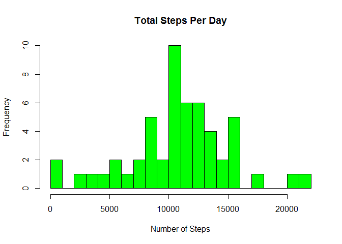

# Course Project 1
Nigel Millick  

## Step 1

Loading and preprocessing the data 

```r
data <- "repdata%2Fdata%2Factivity.zip"

if(!file.exists("~/R/win-library/repdata%2Fdata%2Factivity")) {
        unzip(data)
}

activity <- read.csv("~/R/win-library/repdata%2Fdata%2Factivity/activity.csv")
```


## Step 2

What is mean total number of steps taken per day?

```r
stepsByDay <- aggregate(steps ~ date, activity, sum)

hist(stepsByDay$steps, breaks = 20, main = "Total Steps Per Day", col="green", xlab="Number of Steps")
```

<!-- -->

```r
meanStep <- mean(stepsByDay$steps)
medianStep <- median(stepsByDay$steps)
```

 

The `mean` is 1.0766189\times 10^{4} and the `median` is 10765.

## Step 3

What is the average daily activity pattern?

```r
stepsByInterval <- aggregate(steps ~ interval, activity, mean)

plot(stepsByInterval$interval,stepsByInterval$steps, type="l", xlab="Interval", ylab="Number of Steps",main="Average Number of Steps per Day by Interval")
```

<!-- -->

```r
maxInterval <- stepsByInterval[which.max(stepsByInterval$steps),1]
```

 

The 5-minute interval containing the maximum number of steps is 835.

## Step 4
Imputing missing values


```r
activity2 <- activity
incomplete <- is.na(activity2$steps)

averageStep <- tapply(activity2$steps, activity2$interval, mean, na.rm = TRUE, simplify = T)
activity2$steps[incomplete] <- averageStep[as.character(activity2$interval[incomplete])]
```

The NA's were replaced by the average over the 5 minute intervals for the period. This helps ensure smoothness across the graph.

Recount total steps by day and create Histogram. 

```r
stepsByDay2 <- aggregate(steps ~ date, activity2, sum)
hist(stepsByDay2$steps, breaks = 20, main = "Total Steps per Day", col="blue", xlab="Number of Steps")

#Create Histogram to show difference. 
hist(stepsByDay$steps,breaks = 20, main = "Total Steps per Day", col="red", xlab="Number of Steps", add=T)
legend("topright", c("Imputed", "Non-imputed"), col=c("blue", "red"), lwd=10)
```

<!-- -->

 

Calculate new mean and median for imputed data. 

```r
meanStep2 <- mean(stepsByDay2$steps)
medianStep2 <- median(stepsByDay2$steps)
```

Calculate difference between imputed and non-imputed data.

```r
meanDif <- meanStep2 - meanStep
medDif <- medianStep2 - medianStep
```

Calculate total difference.

```r
totalDif <- sum(stepsByDay2$steps) - sum(stepsByDay$steps)
```
* The imputed data mean is 1.0766189\times 10^{4}
* The imputed data median is 1.0766189\times 10^{4}
* The difference between the non-imputed mean and imputed mean is 0
* The difference between the non-imputed mean and imputed mean is 1.1886792
* The difference between total number of steps between imputed and non-imputed data is 8.6129509\times 10^{4}.
* The means and medians appear roughly the same after imputing the missing data


## Step 5
Are there differences in activity patterns between weekdays and weekends? 

```r
activity2$date <- as.Date(activity2$date)
activity2$day <- weekdays(activity2$date)
activity2$week = as.factor(ifelse(activity2$day == "Saturday" | activity2$day == "Sunday", "weekend", "weekday"))

stepsByInterval2 <- aggregate(steps ~ interval + week, activity2, mean)

library(lattice)

xyplot(stepsByInterval2$steps ~ stepsByInterval2$interval | stepsByInterval2$week, 
       main="Average Steps per Day by Interval",xlab="Interval", ylab="Steps",layout=c(1,2), type="l")
```

<!-- -->

 
There appears to be more activity on weekends than weekdays.
